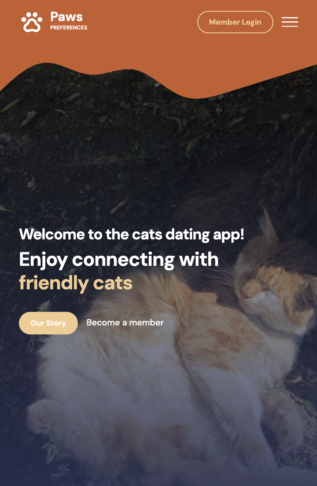
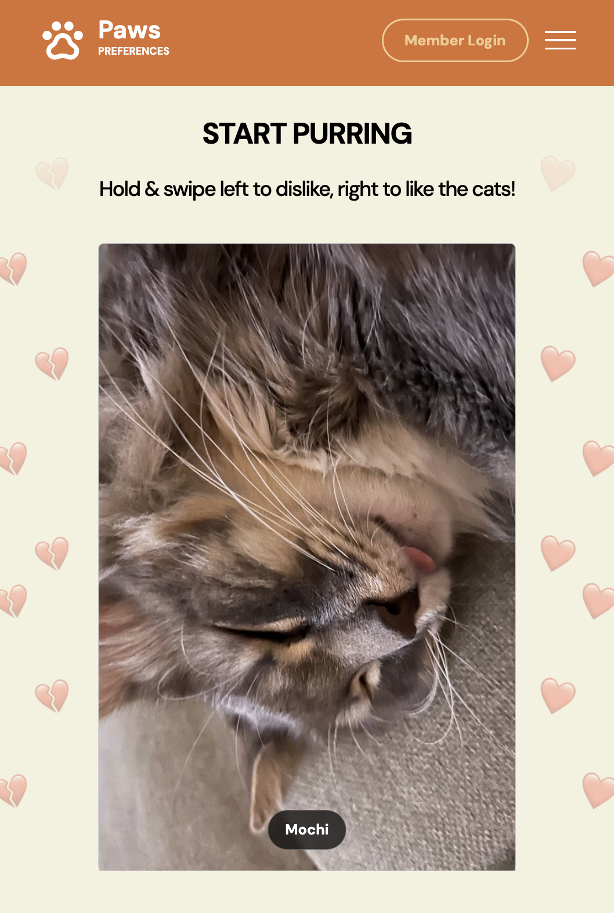
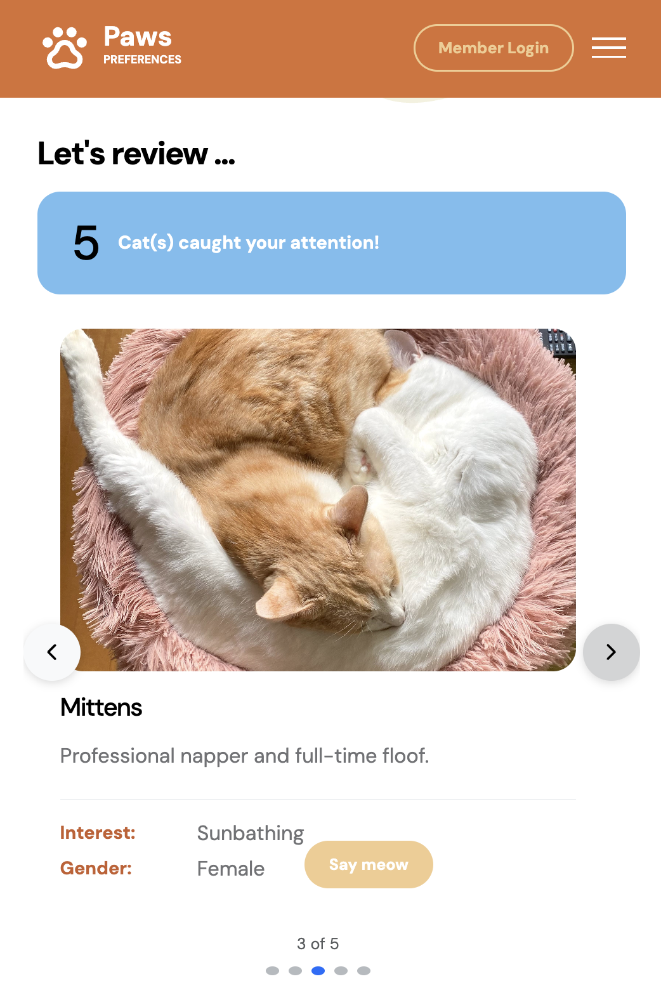
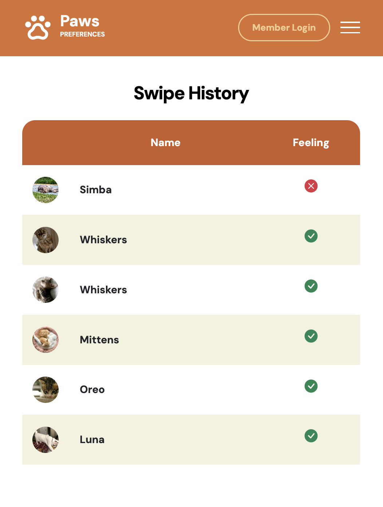
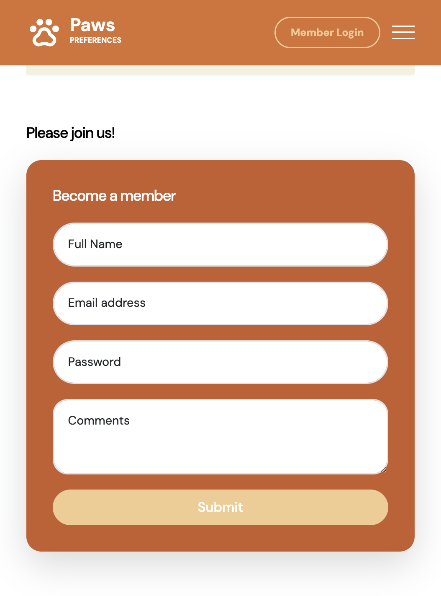
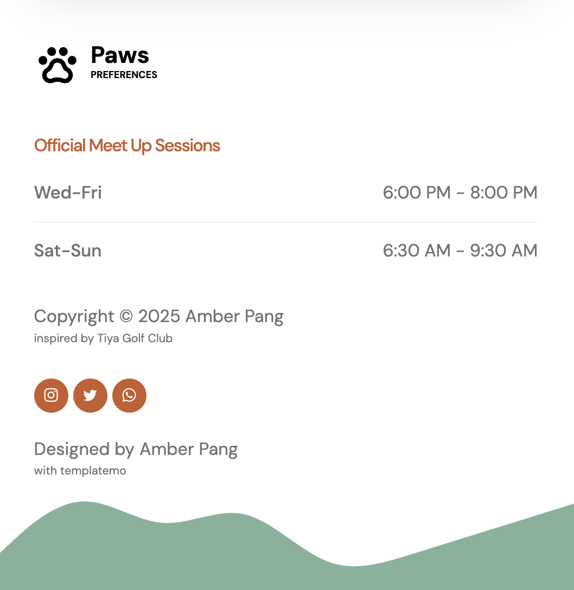

# Paws Preferences 🐾

**Find your purrfect companion with a swipe!**

Paws Preferences is a delightful single-page web application inspired by the popular dating app concept, but with a feline twist. Instead of people, you get to swipe through adorable cat profiles, liking or disliking them to find your ideal furry friend. This project is built with React and leverages Firebase for basic user authentication.

## Features

*   **Navbar with Sidebar:** Easy navigation to all sections of the app.
*   **Hero Section:** A welcoming introduction to the world of Paws Preferences.
*   **Interactive Swiping:** Swipe right to "like" and left to "dislike" cats. The intuitive interface makes finding your favorite felines fun and engaging.
*   **Liked Cats Summary:** A dedicated section to review all the cats you've liked, making it easy to keep track of your potential companions.
*   **Swipe History:** A comprehensive log of all your swipes, so you never lose track of the cats you've seen.
*   **User Authentication:** A basic sign-up and login system powered by Firebase to get you started on your cat-swiping journey.
*   **Footer:** Containing additional links and information.
<br>








# Project Structure
```plaintext
paws-preferences/
├── package.json       # Lists project dependencies and scripts
├── package-lock.json  # Records the exact version of each installed package
├── README.md          # Project documentation
├── public/
│   ├── index.html     # HTML file for the React application
│   └── ...            # Other static assets like favicons and manifest.json
│
└── src/
    ├── assets/
    │   ├── css/             # Stylesheets for the application
    │   ├── fonts/           # Font files used in the project
    │   └── images/          # Image assets for the application
    │
    ├── components/
    │   ├── FirebaseConfig.js  # Firebase configuration and initialization
    │   ├── Footer.js          # Footer component for the page
    │   ├── HeroSection.js     # Top hero/welcome section component
    │   ├── Navbar.js          # Navigation bar and sidebar component
    │   ├── SignUp.js          # User sign-up form component
    │   └── Summary.js         # Review section to display liked cats
    │
    ├── App.js                 # Main application component that assembles all other components
    ├── App.test.js            # Test file for the main App component
    ├── FirebaseTest.js        # A component for testing Firebase functionality
    ├── bootstrap.bundle.min.js# Bootstrap JavaScript bundle
    ├── index.js               # The entry point for the React application
    ├── reportWebVitals.js     # Measures and reports on web performance metrics
    ├── setupTests.js          # Setup file for running tests
    └── ...                    # Other miscellaneous files like SVGs
```
## Getting Started

These instructions will get you a copy of the project up and running on your local machine for development and testing purposes.

### Prerequisites

You will need to have Node.js and npm installed on your machine.

### Installation

1.  **Clone the repository:**
    ```sh
    git clone https://github.com/aphyueh/paws-preferences.git
    ```
2.  **Navigate to the project directory:**
    ```sh
    cd paws-preferences
    ```
3.  **Install the dependencies:**
    ```sh
    npm install
    ```
4.  **Start the development server:**
    ```sh
    npm start
    ```

The application will be running on `http://localhost:3000`.

## Built With

*   [React](https://reactjs.org/) - A JavaScript library for building user interfaces.
*   [Firebase](https://firebase.google.com/) - Used for user authentication.
*   [Cat as a Service](https://cataas.com/) - API for cat images


## Acknowledgements

*   Inspired by [Tiya Golf Club](https://templatemo.com/tm-587-tiya-golf-club) template